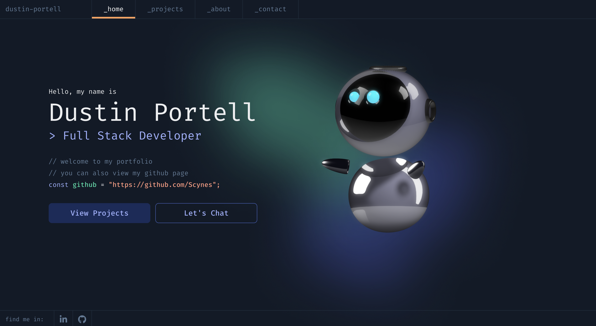

# My Devleoper Portfolio V3

Welcome to my reimagined developer portfolio! This project is a unique reflection of my skills, creativity, and the tech I'm passionate about. Built with cutting-edge tools and frameworks, it showcases who I am as a developer.

## 🌟 Features

- **Interactive 3D Design**: Thanks to Spline, there's a cool 3D experience that adds depth (pun intended) to the portfolio.
- **Responsive and Fast**: Built with Next.js and styled with Tailwind CSS for performance across devices.
- **Customizable and Extendable**: This portfolio can grow as my skills and projects do, and it’s easy to add new sections or improve the existing features.
- **Smooth Animations**: Framer Motion ensures transitions are buttery smooth and visually pleasing.
- **Resume Integration**: My resume is viewable and downloadable in PDF format directly from the site using React PDF.

---

## 🚧 Ongoing Improvements

While the portfolio is mostly complete, there are still a few areas I’m refining:
- 🔧 Potential removal or refinement of the 3D robot.
- 💡 Considering adding a blog section, though still debating its necessity.
- 🧹 General tweaks and optimizations.

## 📝 Feedback & Contributions

Feel free to open issues or pull requests if you have suggestions, or just drop me a message—I’m all ears! 👂

## 📜 License

This project is open-source under the [MIT License](LICENSE).
